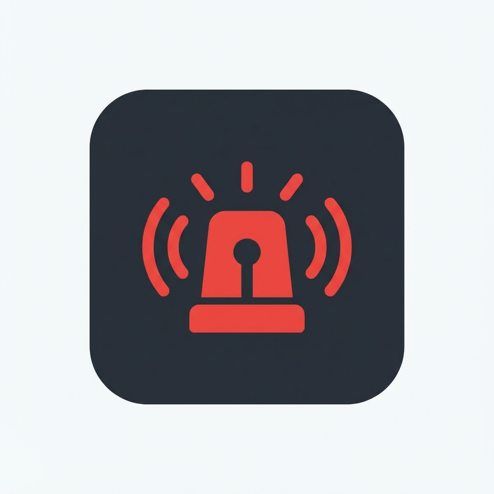

# Team Alert System

A desktop application for instant team communication with boss alerts. Built with Electron and Node.js.



## Features

- 🚨 **Instant Alerts**: Send alerts to all 9 team members with one click
- ⌨️ **Global Shortcuts**: Press `Numpad /` or `*` from anywhere to send alerts
- 🔔 **Native Notifications**: Reliable Windows notifications even when app is minimized
- 🎯 **System Tray**: Runs quietly in background
- 🚀 **Auto-Start**: Launches automatically with Windows
- 📊 **Live Status**: See who's online in real-time
- 📝 **Alert History**: View recent alerts

## System Requirements

- **Operating System**: Windows 10 or later
- **Node.js**: 18.x or later (for development)
- **Network**: Local network or VPN connectivity to server

## Installation

### For End Users

1. Download the installer: `Team-Alert-Setup-1.0.0.exe`
2. Run the installer and follow the prompts
3. Launch the app
4. Configure your username and server URL in Settings
5. The app will start automatically with Windows

### For Developers

1. Clone this repository
2. Install dependencies for server:
   ```bash
   cd server
   npm install
   ```
3. Install dependencies for client:
   ```bash
   cd ..
   npm install
   ```

## Usage

### Starting the Server

1. Navigate to the server directory:
   ```bash
   cd server
   ```

2. Start the server:
   ```bash
   npm start
   ```

3. The server will run on `http://localhost:3000` by default

4. **For production**: Use PM2 or similar to keep server running
   ```bash
   npm install -g pm2
   pm2 start index.js --name team-alert-server
   pm2 save
   pm2 startup
   ```

### Running the Client App (Development)

1. Make sure the server is running
2. Start the Electron app:
   ```bash
   npm start
   ```

### Building the Installer

To create a Windows installer:

```bash
npm run build
```

The installer will be created in the `dist` folder.

## Configuration

### Server Configuration

Edit `server/.env`:

```env
PORT=3000
NODE_ENV=production
LOG_LEVEL=info
```

### Client Configuration

Settings are configured in the app:
1. Click the Settings (⚙️) button
2. Configure:
   - **Username**: Your display name
   - **Server URL**: `http://[server-ip]:3000`
   - **Auto-start**: Launch with Windows
   - **Sound**: Enable alert sound

## Keyboard Shortcuts

- **Numpad /** - Send alert to all team members
- **Numpad *** - Send alert (alternative)

These shortcuts work even when the app is minimized or you're in another application.

## Network Setup

### Local Network Server

1. **Choose a server PC**: This PC must be always on and accessible to all team members
2. **Find the server's IP address**:
   ```bash
   ipconfig
   ```
   Look for "IPv4 Address" (e.g., `192.168.1.100`)

3. **Configure firewall**: Allow incoming connections on port 3000
   ```bash
   netsh advfirewall firewall add rule name="Team Alert Server" dir=in action=allow protocol=TCP localport=3000
   ```

4. **Start the server** on that PC

5. **Configure clients**: Each team member should use `http://[server-ip]:3000` in settings

### Testing Connection

1. On the server PC, open browser to `http://localhost:3000/health`
2. On client PCs, open browser to `http://[server-ip]:3000/health`
3. Both should show: `{"status":"healthy",...}`

## Troubleshooting

### Can't connect to server
- Verify server is running: Check `http://[server-ip]:3000/health`
- Check firewall on server PC
- Verify all PCs are on same network
- Try pinging server: `ping [server-ip]`

### Shortcuts not working
- Make sure no other app is using those shortcuts
- Try restarting the app
- Check if app is running (look for icon in system tray)

### Notifications not appearing
- Grant notification permissions in Windows Settings
- Check if Focus Assist is enabled (it blocks notifications)
- Verify sound is enabled in app settings

### App doesn't start automatically
- Enable "Start with Windows" in Settings
- Check Windows Task Manager > Startup tab

## File Structure

```
red/
├── server/                     # WebSocket Server
│   ├── index.js               # Main server file
│   ├── config.js              # Configuration
│   ├── package.json           # Server dependencies
│   └── .env                   # Environment variables
│
├── main.js                    # Electron main process
├── preload.js                 # Context bridge
├── package.json               # Electron app dependencies
│
├── renderer/                  # UI Files
│   ├── index.html            # Main window
│   ├── settings.html         # Settings window
│   ├── styles.css            # Styling
│   ├── app.js                # Main window logic
│   └── settings.js           # Settings logic
│
├── assets/                    # Resources
│   ├── icon.png              # App icon
│   └── alert.mp3             # Alert sound
│
└── README.md                  # This file
```

## API Endpoints

### Server HTTP Endpoints

- `GET /health` - Server health check
- `GET /users` - List connected users

### WebSocket Events

#### Client → Server
- `register` - Register user with username
- `send-alert` - Send alert to all users
- `heartbeat` - Keep connection alive

#### Server → Client
- `registered` - Registration confirmation
- `alert` - Alert received
- `user-joined` - Team member joined
- `user-left` - Team member left
- `users-update` - Online users update

## Security Notes

- This system is designed for use on a trusted local network
- There is no authentication (trust-based system)
- For additional security:
  - Run on isolated VLAN
  - Use VPN for remote access
  - Add authentication (see future enhancements)

## Future Enhancements

- [ ] Custom alert messages
- [ ] User authentication
- [ ] Alert categories (urgent, normal, all-clear)
- [ ] Mobile app support
- [ ] Encrypted connections (WSS)
- [ ] Alert acknowledgement
- [ ] Do Not Disturb mode

## License

MIT License

## Support

For issues or questions, contact your IT administrator.

---

**Built with ❤️ for team communication**
